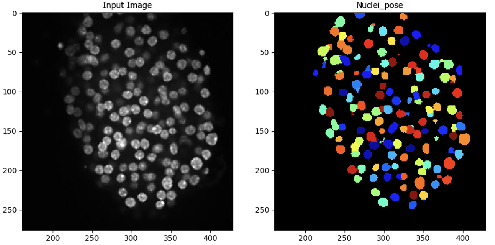
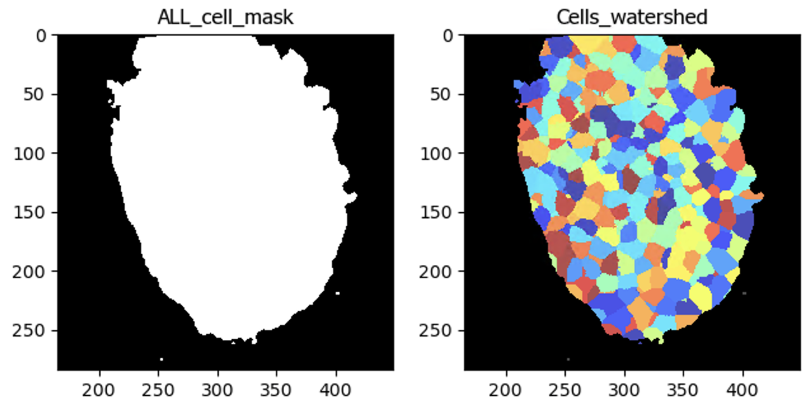

# CellProfiler cellpose detection README

## Data

This pipeline was developed for 3D images of mouse islets stained for insulin (marking beta cells), glucagon (marking alpha cells), and Ki67 (a marker of cell division). Images are 2000 x 2000 x 41 stacks (XYZ). There are two pipelines included here: 1) the original "test_cellpose_3D_v8.9.cppipe" configured for an earlier version of the runCellpose module using cellpose version <1.0 and 2) "Cellpose_3D_islet.cppipe" which has been modified for use with the latest (April 2022) version of the module, which utilizes cellpose > 1.0. Results will differ slightly between these two pipelines.

## Instructions

These pipelines require installing cellprofiler from source and downloading and configuring the cellprofiler-plugins repo. Check out the instructions available [on Github](https://github.com/CellProfiler/CellProfiler-plugins).

Note that a GPU is required for the example image to be processed in a timely fashion. If you don't have a GPU, try cropping the image down first with a Crop module.

## Example results - second image in set

