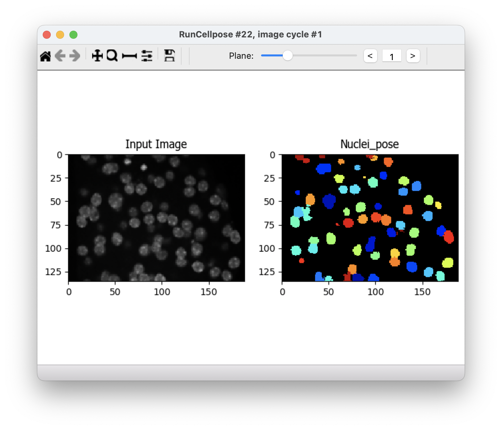
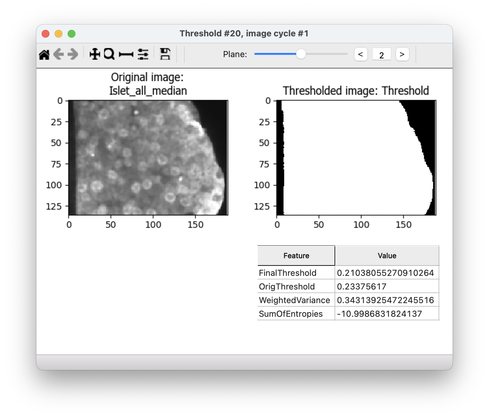
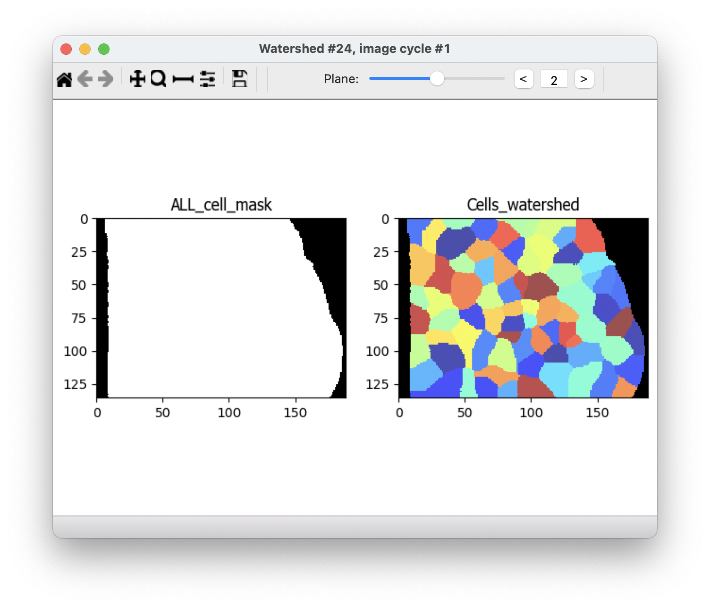

# CellProfiler cellpose detection README

## Data

This pipeline was developed for 3D images of mouse islets stained for insulin (marking beta cells), glucagon (marking alpha cells), and Ki67 (a marker of cell division). Images are found in "example_images" and an extra "cropped_example_images" folder includes smaller images for speed when running the pipeline on a computer without a GPU (beware that this could still take several minutes to run on your machine). The pipeline file is called "Cellpose_3D_islets.cppipe" and is built for use with runCellpose using Cellpose 2.0.

## Instructions

These pipelines require installing cellprofiler from source and downloading and configuring the cellprofiler-plugins repo. Check out the instructions available [on Github](https://github.com/CellProfiler/CellProfiler-plugins).

Note that a GPU is required for the example image to be processed in a timely fashion. If you don't have a GPU, use the cropped_example_images.

## Example results

### Cellpose segmentation of nuclei (RunCellpose):

### Finding the whole islet (RemoveHoles):

### Find the cell borders inside the islet (Watershed):

